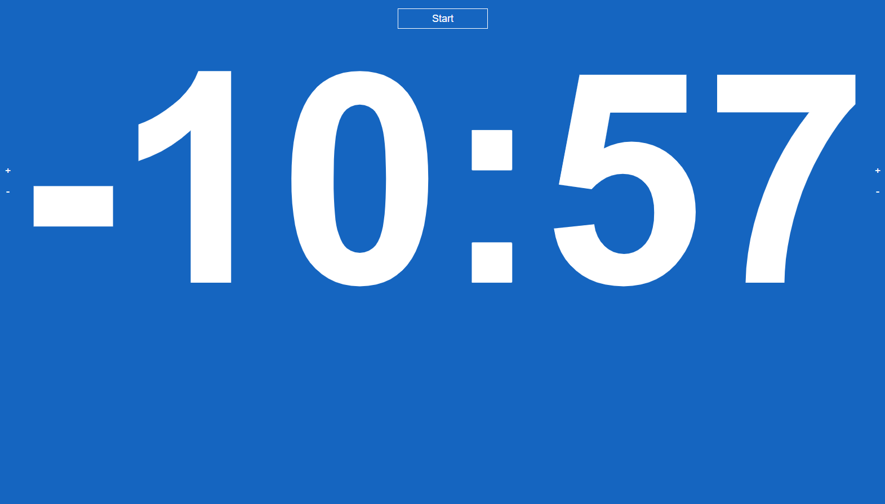
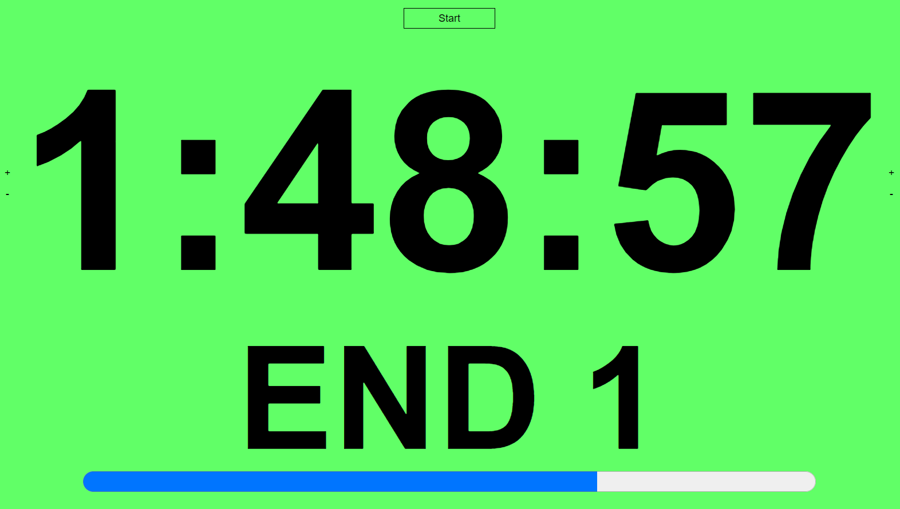
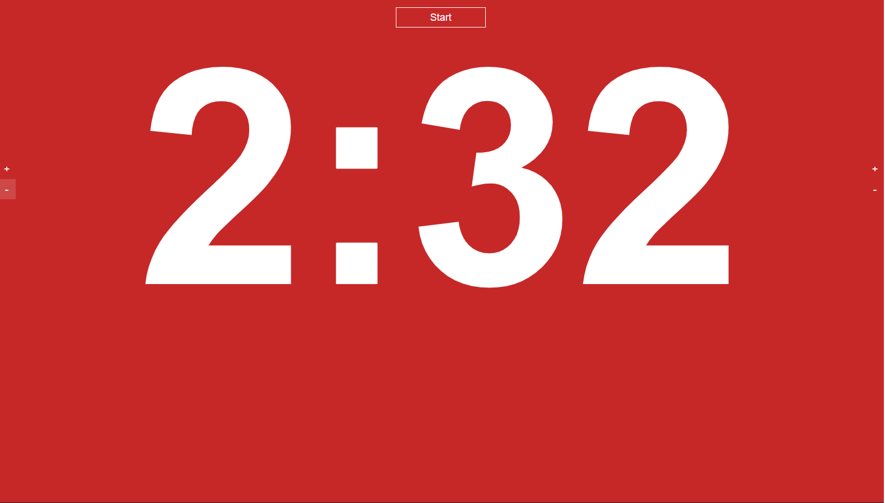
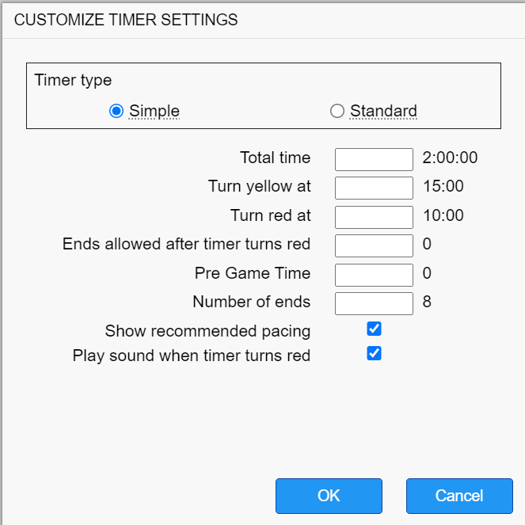
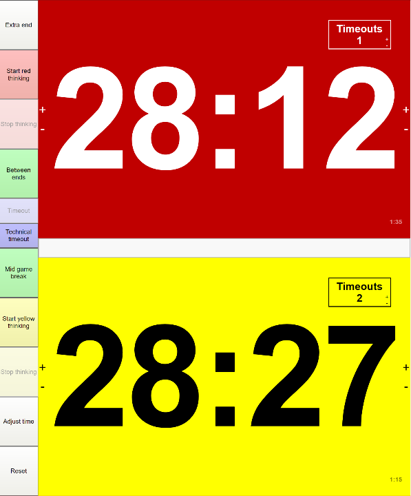
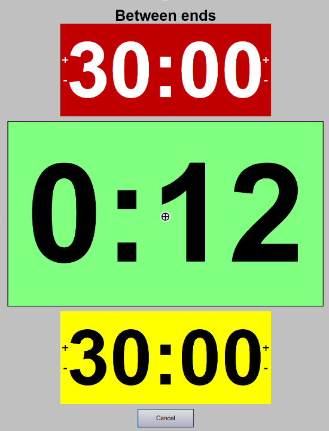
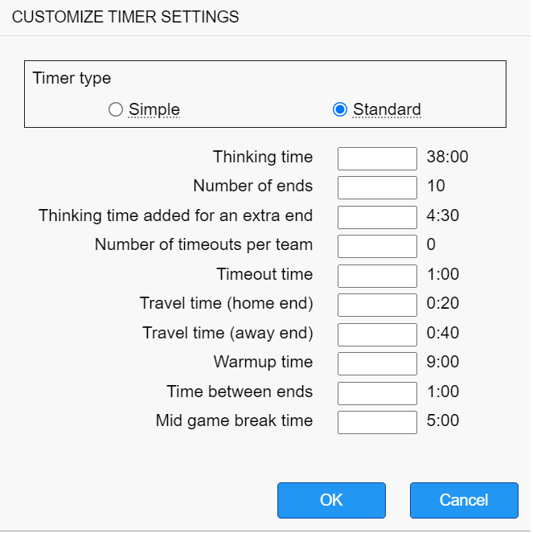
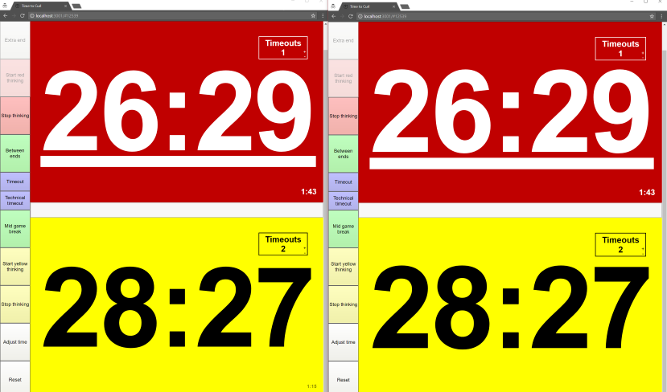

# Time To Curl
***Time To Curl*** is a node web server that manages timers for curling matches, as well as a client interface to display and manage those timers. Using Web Sockets, we sync clients with all updates in real-time.

## Goals of this project
- Facilitate easy timekeeping for different kinds of curling matches
- Support "thinking time" and simple (unmanaged) timers
- Allow easy display of one or more time clocks
- Low latency
- Remote control

## Features (including planned features)
- Client-server timer model - allows multiple clients to view a timer
- Instantaneous updates
- Fully configurable, but still works out of the box
- Easy error correction
- Fault-tolerant - can recover even after a network outage
- Auto-scaling UI fits the given screen size
- Supports multiple concurrent timers
- Choose between basic timing (simple countdown) and WCF official timing (active timekeeper required)
- Keyboard shortcuts (configurable tbd)

## Screenshots

### Simple timers

Show a countdown to the start of the game so players are actively aware of when they need to be on the ice to begin their game. Timer automatically starts the game clock when the countdown hits 0:00.

Progress through each end is shown so curlers know when they are falling behind. The current end is calculated based on the total time, the total number of ends played, and the number of ends allowed _after_ the clock turns red.

The yellow background serves as a warning that their time is almost up. Completely configurable.

When the clock turns red, the pressure is off. Some clubs prefer no more ends to be played, some allow one additional. Completely configurable.

Configure timers.

### Standard (thinking time) timers

Classic theme is familiar to experienced timekeepers.

### Between ends UI.

Includes controls for adjusting time during breaks such as timeouts, between ends, and mid-game.

### Timer settings

Configure all the variables!

### Synchronized timers

Timers are always perfectly synchronized between browsers, even on multiple machines.

## Installing and running Time to Curl
There are plans to run this application on a public server with a domain name. Until then, you must host it yourself. To do that, follow these instructions (Windows):

1. Download and install NodeJS from https://nodejs.org. Make sure you leave all the defaults checked during installation.
2. Either [download](https://github.com/trianglecurling/timetocurl/archive/master.zip) and extract the Time to Curl zip, or clone the repository using Git.
3. Open a command prompt and navigate to the Time to Curl directory (i.e. the directory containing this README.md file).
4. Type `npm install` and press Enter.
5. Type `npm run build` and press Enter.
6. **Type `npm run start` and press Enter.

At this point the program is running. You can open a web browser and navigate to http://localhost:3001 to use it. **From now on, to run Time to Curl, you only need to do step 6 above from within the application directory in a command prompt.

## Curl with Curl...
You can update timers with basic HTTP requests (i.e. using curl). Eventually I will have all the commands documented. Here's an example for now.

**Add time to a basic timer**  
`curl -XPOST -H "Content-type: application/json" -d '{"action": {"request":"QUERY_TIMER","options":{"command":"ADD_TIME","data":"{\"value\":nn}","timerId":"xxxxx"}}}' 'server-uri'`

Replace `nn` with the number of seconds to add to the timer.  
Replace `xxxxx` with the timer ID (look in the URL).  
Replace `server-uri` with the URI to the server.

**Example**  
`curl -XPOST -H "Content-type: application/json" -d '{"action": {"request":"QUERY_TIMER","options":{"command":"ADD_TIME","data":"{\"value\":60}","timerId":"13586"}}}' 'http://localhost:3001/'`

**Start a basic timer**  
`curl -XPOST -H "Content-type: application/json" -d '{"action": {"request":"QUERY_TIMER","options":{"command":"START_TIMER","timerId":"xxxxx"}}}' 'server-uri'`

**Pause a basic timer**  
`curl -XPOST -H "Content-type: application/json" -d '{"action": {"request":"QUERY_TIMER","options":{"command":"PAUSE_TIMER","timerId":"xxxxx"}}}' 'server-uri'`

*Hofstadter's Law: It always takes longer than you expect, even when you take into account Hofstadter's Law.*
